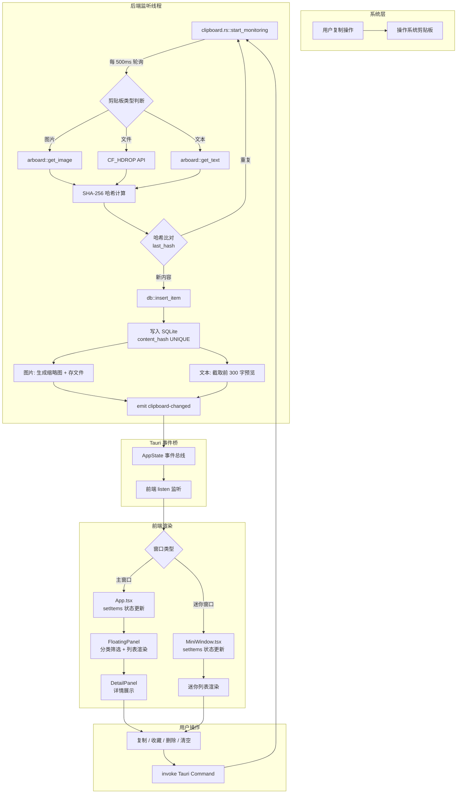

# Clipboard Workbench (CopyBox) — 项目展示文档

> 一个基于 Tauri 2 的跨平台剪贴板管理器，支持文本、图片、文件的自动捕获、去重存储与快速回溯。

---

## 一、项目简介

CopyBox 是一款运行于 Windows 平台的本地剪贴板管理工具。它在你后台静默运行，自动记录每一次复制的内容（文本、链接、代码、图片、文件），通过哈希去重避免重复条目，并提供分类浏览、收藏标记、全文检索、小窗模式等功能，帮助你高效管理和回溯剪贴板历史。

---

## 二、核心功能

| 功能 | 说明 |
|------|------|
| 自动捕获 | 后台监听剪贴板变动，无需手动操作 |
| 智能分类 | 自动识别文本 / 链接 / 代码 / 图片 / 文件，按类别筛选 |
| 哈希去重 | SHA-256 内容指纹，相同内容不产生重复记录 |
| 图片预览 | 自动生成缩略图（200x200），支持双击原图打开 |
| 文件记录 | 通过 Windows CF_HDROP 捕获复制到剪贴板的文件路径 |
| 收藏标记 | 重要条目可加星标收藏，清空时自动保留 |
| 缓存管理 | 孤儿文件清理、过期自动删除、存储上限管控 |
| 全局快捷键 | 可配置快捷键（默认 Ctrl+Space），一键显隐窗口 |
| 双窗口模式 | 主窗口（完整管理）+ 迷你窗口（快速浏览）自由切换 |
| 主题切换 | 深色 / 浅色主题，实时生效 |
| 系统托盘 | 最小化到托盘，双击托盘图标唤起窗口 |
| 开机自启 | 通过 Windows 注册表实现自启动 |
| 自定义存储 | 支持指定数据存储目录 |

---

## 三、技术栈

| 层级 | 技术 |
|------|------|
| 前端框架 | React 18 + TypeScript |
| UI 样式 | Tailwind CSS |
| 图标库 | Lucide React |
| 动画 | Framer Motion |
| 桌面框架 | Tauri 2.0 |
| 后端语言 | Rust |
| 数据库 | SQLite (rusqlite, bundled) |
| 剪贴板读取 | arboard (跨平台) + Windows CF_HDROP API |
| 哈希算法 | SHA-256 (sha2 crate) |
| 图片处理 | image crate (缩略图生成 + PNG 编码) |
| 构建工具 | Vite 5 |

---

## 四、项目截图

> *截图待插入*

| 编号 | 说明 |
|------|------|
| 图 1 | 主窗口 — 历史列表 + 详情面板 |
| 图 2 | 迷你窗口 — 悬浮快速浏览 |
| 图 3 | 设置面板 — 存储、快捷键、主题配置 |
| 图 4 | 图片预览 — 缩略图 + 双击打开原图 |
| 图 5 | 系统托盘菜单 |

---

## 五、安装与运行

### 前置条件

- **Node.js** >= 18
- **Rust** >= 1.77（通过 [rustup](https://rustup.rs) 安装）
- **Windows** 10/11（文件剪贴板功能依赖 Windows API）

### 步骤

```bash
# 1. 进入项目目录
cd clipboard-workbench

# 2. 安装前端依赖
npm install

# 3. 启动开发模式（热重载）
npm run tauri dev

# 4. 构建生产版本
npm run tauri build
```

构建产物位于 `src-tauri/target/release/copybox.exe`。

---

## 六、系统架构



**说明**：后端监听线程轮询系统剪贴板，对每次变更做 SHA-256 哈希去重，新内容写入 SQLite 后通过 Tauri 事件机制推送到前端。前端无需轮询，完全由事件驱动更新状态。用户操作同样通过 Tauri Command 走回后端，确保数据库为单一数据源。

---

## 七、核心难点与解决

### 难点 1：图片去重与缓存管理

**问题现象**

用户多次复制同一张图片（例如从聊天窗口反复复制），会产生重复的 PNG 文件存储，导致磁盘空间膨胀。同时，数据库中已删除的条目的图片文件可能残留在 `images/` 目录中（孤儿文件）。

**根本原因**

- 图片内容无法像文本一样直接做字符串哈希比对，必须以原始像素数据（RGBA bytes）为输入计算哈希
- 数据库通过 `content_hash UNIQUE` 约束防止重复记录，但图片的存储路径是时间戳命名的，每次"重复插入"会生成新文件，旧文件不会自动删除
- 用户通过前端删除条目时，如果不手动清理对应的图片文件，会形成孤儿文件

**解决方案**

1. **内容哈希去重**：在 `clipboard.rs` 中，每次读取图片后立即对 `img.bytes`（RGBA 原始数据）计算 SHA-256。通过内存中的 `last_hash` 与数据库中的 `content_hash UNIQUE` 双重去重：
   - `last_hash` 命中 → 跳过（同一会话内重复复制）
   - `content_hash` 命中 → `INSERT OR REPLACE`，返回 `old_id` 和 `old_content`（旧文件路径），通过事件通知前端删除旧条目，并物理删除旧图片文件

2. **防抖机制**：通过 `last_written` 记录最后一次由程序自己写入剪贴板的时间戳，监控线程在 500ms 内跳过，避免"用户点击复制 → 程序写入剪贴板 → 监控线程误捕获"的死循环

3. **孤儿文件清理**（`clear_cache` 命令）：
   - 扫描 `images/` 目录中所有文件
   - 查询数据库中所有 `content_type = 'image'` 的记录路径
   - 删除不在数据库记录中的文件，并返回释放的磁盘空间

4. **存储上限管控**（`enforce_storage_limit`）：
   - 计算所有记录的总 `size`
   - 超出上限时从最旧的非收藏条目开始逐条删除
   - 保留 10MB 缓冲空间避免频繁触发

5. **过期自动清理**（`cleanup_old_items`）：
   - 监控线程每 30 秒（tick % 60）触发一次
   - 删除超过 `auto_clean_days` 天的非收藏条目

**最终效果**

- 相同图片无论复制多少次，数据库只保留一条记录，物理文件只保留一个 copy
- 孤儿文件可通过缓存清理功能一键回收
- 存储空间始终在用户设定的上限内

---

### 难点 2：前端与后端的删除事件同步

**问题现象**

用户在迷你窗口清除一条记录后，主窗口的列表不会自动更新；反之，用户在主窗口删除条目后，迷你窗口仍显示旧数据。两个窗口各自维护独立的 React 状态，如果没有可靠的事件同步机制，就会出现数据不一致。

**根本原因**

- Tauri 多窗口架构下，每个窗口是独立的 WebView 实例，各自运行独立的 React 应用
- 传统的"删除 → 重新加载列表"方案需要窗口获得焦点才能触发，用户体验差且不可靠
- 迷你窗口的 `clear_item` 是"软删除"（`is_cleared = true`），需要更新条目字段而非移除条目，这比简单的"硬删除"更难同步

**解决方案**

1. **事件驱动同步**：所有状态变更都通过 Tauri 事件机制广播：
   - `clipboard-changed`：新条目插入或更新（携带 `old_id` 用于替换旧条目）
   - `item-cleared`：条目被软清除（携带完整更新后的条目对象）
   - `settings-changed`：设置变更（主题、存储路径等）
   - `navigate`：导航指令（切换到设置页）

2. **前端事件处理**：
   - 主窗口（`App.tsx`）监听了 `clipboard-changed` 和 `navigate`
   - 迷你窗口（`MiniWindow.tsx`）额外监听了 `item-cleared` 和 `settings-changed`

3. **增量更新而非全量刷新**：
   ```typescript
   // clipboard-changed 处理：用 new_id 替换旧条目（如果有 old_id）
   setItems((prev) => {
     const list = old_id ? prev.filter((i) => i.id !== old_id) : prev;
     return [item, ...list];
   });

   // item-cleared 处理：用更新后的条目原地替换
   setItems((prev) => prev.map((i) =>
     i.id === event.payload.id ? event.payload : i
   ));
   ```

4. **清理钩子**：所有 `listen()` 返回的 Promise 都通过 `then(fn => fn())` 在组件卸载时取消订阅，避免内存泄漏。

**最终效果**

- 用户在任意窗口操作，另一个窗口实时同步，无需手动刷新
- 增量更新避免了不必要的全量查询和重渲染
- 软删除和硬删除由同一个事件 pipeline 处理，逻辑统一

---

### 难点 2.1：迷你窗口 WebView 延迟创建导致事件丢失

**问题现象**

用户在应用启动后立刻复制内容，然后按快捷键切出迷你窗口——新复制的内容没有出现在迷你窗口列表中。但关闭再重新打开迷你窗口后，内容又恢复正常。

**根本原因**

Tauri 多窗口架构下，迷你窗口的 WebView 实例不是应用启动时就创建的，而是在**首次调用 `switch_to_mini` 时按需创建**。这意味着：

- 迷你窗口的 `listen('clipboard-changed', ...)` 注册发生在 WebView 创建时
- 如果用户在迷你窗口首次打开**之前**已经复制了内容，那些 `clipboard-changed` 事件已经由后端发出
- 迷你窗口的 `listen()` 注册晚于事件发出，错过了这些事件，且不会自动补发

**解决方案**

在迷你窗口的 `focus` 事件中增加 `loadItems()` 兜底刷新（`MiniWindow.tsx:68`）：

```typescript
// Sync theme + data whenever window gains focus (belt-and-suspenders)
const onFocus = () => { syncTheme(); loadItems(); };
window.addEventListener('focus', onFocus);
```

**工作原理**：

- 正常场景：`clipboard-changed` 事件实时推送 → 前端增量更新（主路径）
- 兜底场景：窗口获得焦点 → `loadItems()` 全量拉取数据库最新列表（弥补事件丢失）
- `focus` 事件每次窗口显示时触发，覆盖了 WebView 延迟创建、窗口从隐藏恢复、切换窗口等所有丢失事件的场景

**最终效果**

- 无论迷你窗口何时首次打开，都能看到最新的剪贴板历史
- 全量刷新仅在焦点事件时触发，正常增量更新路径不受影响
- 两个窗口的数据一致性得到双重保障

---

### 难点 3：无边框窗口拖动与窗口控制

**问题现象**

Tauri 窗口使用 `decorations: false` 去除原生标题栏后，窗口无法拖动，最小化/最大化/关闭按钮也需要手动实现。此外，迷你窗口需要特殊的"跳过任务栏"行为（`skipTaskbar: true`），且两个窗口之间切换时需要正确处理显示/隐藏状态。

**根本原因**

- 去除原生装饰后，操作系统不知道窗口的"可拖动区域"在哪里
- 关闭按钮的默认行为是销毁窗口，但用户期望关闭按钮执行"隐藏到托盘"而非退出应用
- 两个窗口共享同一个 Rust 后端，但需要独立追踪各自的可见性状态

**解决方案**

1. **自定义拖动区域**：在标题栏 DOM 元素上使用 Tauri 的 `data-tauri-drag-region` 属性（`Titlebar.tsx:25`）：
   ```html
   <div data-tauri-drag-region style="WebkitAppRegion: 'drag'">
     CopyBox
   </div>
   ```

2. **自定义窗口控制按钮**：通过 Rust 命令实现（`lib.rs`）：
   - `minimize_window` — 调用 `w.minimize()`
   - `toggle_maximize_window` — 调用 `w.maximize()` / `w.unmaximize()`
   - `close_window` — 调用 `w.close()`（关闭事件被拦截为隐藏，见下文）

3. **关闭 → 隐藏到托盘**：通过监听 `WindowEvent::CloseRequested` 事件（`lib.rs:630-644`）：
   ```rust
   window.on_window_event(move |event| {
       match event {
           tauri::WindowEvent::CloseRequested { api, .. } => {
               api.prevent_close();  // 阻止真正关闭
               w.hide();              // 改为隐藏到托盘
           }
           ...
       }
   });
   ```

4. **窗口切换状态管理**：通过 `AppState` 中的 `last_active_label` 和 `window_visible` 追踪：
   - 切换时隐藏当前窗口、显示目标窗口
   - 全局快捷键和托盘双击均根据 `last_active_label` 决定操作哪个窗口
   - 窗口焦点事件自动更新 `last_active_label`

5. **迷你窗口的特殊处理**：
   - `skipTaskbar: true`：不显示在任务栏，避免冗余
   - 独立的 `mini.html` 入口，独立渲染 `MiniWindow` 组件
   - 主窗口和迷你窗口通过 `switch_to_main` / `switch_to_mini` 命令互相切换

**最终效果**

- 用户可通过拖动标题栏任意区域移动窗口
- 点击关闭按钮（X）窗口隐藏到系统托盘，应用不退出
- 全局快捷键和托盘双击可在主窗口和迷你窗口间智能切换
- 迷你窗口不显示在任务栏，保持桌面整洁

---

## 八、演示视频脚本（30 秒）

| 时间 | 画面 | 操作 | 旁白 |
|------|------|------|------|
| 0-5s | 桌面 → CopyBox 主窗口 | 展示软件启动，主窗口界面 | "CopyBox，一款本地剪贴板管理器，开机自动后台运行。" |
| 5-10s | 浏览器 → 复制一张图片 | Ctrl+C 复制图片，迷你窗口自动弹出新条目 | "复制一张图片，自动捕获并生成缩略图预览。" |
| 10-15s | 双击图片条目 | 双击打开原图 | "双击即可查看原图，或一键复制回剪贴板。" |
| 15-20s | 点击侧边栏筛选 | 切换到"图片"分类 | "按类型筛选：文本、链接、代码、图片、文件。" |
| 20-25s | 右键菜单 → 删除 | 删除一条历史记录 | "不需要的内容，一键删除。" |
| 25-30s | 设置 → 清空历史 | 点击清空全部（收藏条目自动保留） | "清空全部历史，收藏条目自动保留。CopyBox，让剪贴板井井有条。" |

### 推荐录屏工具

- **[ScreenToGif](https://www.screentogif.com/)**（免费、开源、轻量）：适合录制短小精悍的 GIF/视频，支持帧编辑、裁剪、字幕叠加。推荐用于制作 30 秒以内的演示动图。
- **[OBS Studio](https://obsproject.com/)**（免费、开源、专业）：适合录制高质量视频，支持多场景切换、音频混音。如果演示需要配音解说，推荐 OBS。

---

## 九、项目结构一览

```
clipboard-workbench/
├── src/                          # 前端源码
│   ├── main.tsx                  # 主窗口入口
│   ├── mini.tsx                  # 迷你窗口入口
│   ├── App.tsx                   # 主窗口根组件
│   ├── types.ts                  # TypeScript 类型定义
│   ├── index.css                 # 全局样式 + CSS 变量（主题）
│   └── components/
│       ├── Titlebar.tsx          # 自定义标题栏（拖动区 + 窗口控制）
│       ├── Sidebar.tsx           # 左侧分类导航
│       ├── FloatingPanel.tsx     # 中间内容流（列表 + 筛选 + 操作）
│       ├── DetailPanel.tsx       # 右侧详情面板
│       ├── MiniWindow.tsx        # 迷你窗口组件
│       ├── SettingsPanel.tsx     # 设置面板
│       ├── SearchBar.tsx         # 搜索栏
│       ├── HistoryItem.tsx       # 历史条目卡片
│       ├── ShortcutCapture.tsx   # 快捷键录制组件
│       ├── ContextMenu.tsx       # 右键菜单
│       ├── TextViewer.tsx        # 全文查看弹窗
│       └── cad_bridge.py         # 外部应用桥接（实验性）
├── src-tauri/                    # Rust 后端
│   ├── Cargo.toml                # Rust 依赖
│   ├── tauri.conf.json           # Tauri 窗口 + 打包配置
│   └── src/
│       ├── main.rs               # 入口
│       ├── lib.rs                # 命令注册 + 状态管理 + 全局快捷键
│       ├── clipboard.rs          # 剪贴板监听线程 + 去重 + 缩略图
│       ├── db.rs                 # SQLite 数据层
│       ├── tray.rs               # 系统托盘
│       └── clean_db.rs           # 数据库清理工具
├── package.json                  # 前端依赖
├── vite.config.ts                # Vite 构建配置
└── tsconfig.json                 # TypeScript 配置
```

---

## 十、待扩展方向

- [ ] 全文搜索（模糊匹配 + 高亮）
- [ ] 多条目合并复制
- [ ] 剪贴板内容加密存储
- [ ] macOS / Linux 跨平台支持
- [ ] 云同步（WebDAV / S3）
- [ ] 剪贴板历史时间线视图
